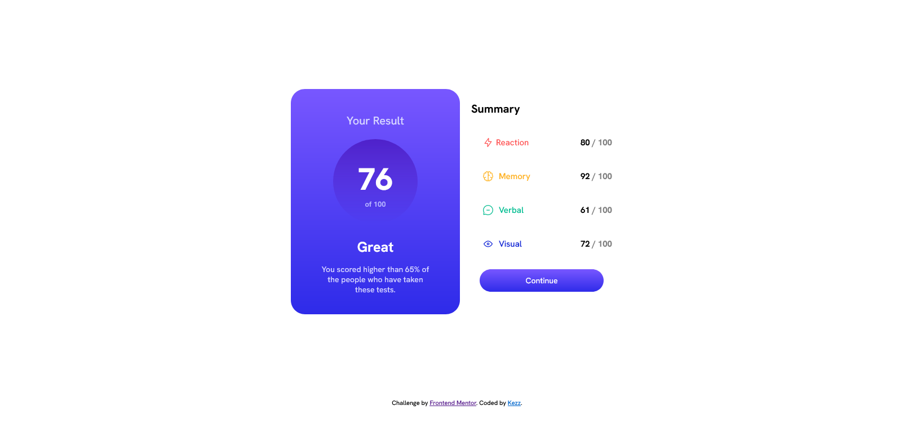

# Frontend Mentor - Results summary component solution

This is a solution to the [Results summary component challenge on Frontend Mentor](https://www.frontendmentor.io/challenges/results-summary-component-CE_K6s0maV). Frontend Mentor challenges help you improve your coding skills by building realistic projects. 

## Table of contents

- [Overview](#overview)
  - [The challenge](#the-challenge)
  - [Screenshot](#screenshot)
  - [Links](#links)
- [My process](#my-process)
  - [Built with](#built-with)
  - [Useful resources](#useful-resources)
- [Author](#author)

## Overview

A 'result summary' component built using HTML and CSS. 

I am still very new to web development and this is my first challenge, I'm sure there's alot that I can improve. Any feedback would help! Thank you!

### The challenge

Users should be able to:

- View the optimal layout for the interface depending on their device's screen size
- See hover and focus states for all interactive elements on the page

### Screenshot

### Links

- Solution URL: [Add solution URL here](https://your-solution-url.com)
- Live Site URL: [Add live site URL here](https://kezzzah.github.io/Results-summary-component/)

### Built with

- Semantic HTML5 markup
- CSS custom properties
- Flexbox
- CSS Grid

### Useful resources

- [W3Schools](https://www.w3schools.com/) - Great resource for all things web dev.

## Author

- Frontend Mentor - [@Kezzzah](https://www.frontendmentor.io/profile/Kezzzah)

